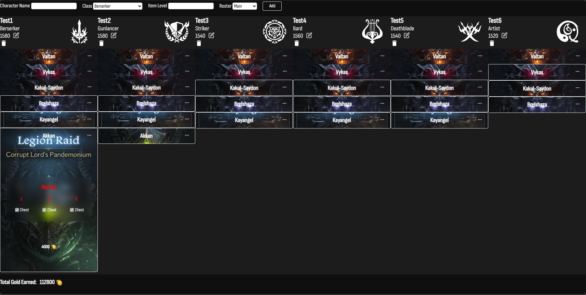

# LostArkGold

A simple app/module to easily track your weekly roster gold from raids.
 
This module may be used for a bigger project in the future.

**Link Coming Soon**

## A brief History

I play Lost Ark on a regular basis. Currently, as of writing this, I have almost 5k hours in the game (not really proud of that btw). However, playing this game made me realize that there was a lot of potential in making cool applications that can assist players in their adventures.

There are the more well-known ones like LOA Todo or the many daily tracker web apps. All great in fulfilling their purpose. I wanted to build this small app/module to help track how much gold I make per week from doing raids. Yes, the daily tracker applications have something for that need, but I felt they were too complicated or they just didn't work as intended.

That's why I went with a more simple and linear approach where you just add your characters, select the raids they do, and it will just show and calculate how much gold is earned.

# Technology Used
<h3>Frontend</h3>

  HTML, CSS, Javascript

<h3>Backend</h3>

  Node.js, Express, MongoDB, Mongoose, EJS

# Optimizations

There are a lot of things I would've loved to have done differently with this app; however, this was mainly built as an MVP rather than an official application. But I will list off a few optimizations that I will get back to in the near future.

1. Load times and data usage:
   - From my short testing, the load times were okay, but maybe the data usage was on the higher side. Definitely changing up my code base, reducing file size, compressing code, and getting rid of redundant code would be the first thing I would change given the chance.

3. Appearance:
   - On a biased look, I thought the appearance and UI were alright as an MVP. However, getting some feedback from players who play Lost Ark, they have given me some insight and possible areas of improvement as to where changes could be applied.

# Future Implementations

As mention above this app was made using Node.js and EJS as a template language. Personally, I would've loved to use React for the frontend and NEXT.js for the backend. 
   
Unfortunately, I'm still learning React and NEXT.js, and I felt like my insufficient knowledge would have hindered the development of this MVP. Plus, I have more experience with Express and EJS.

